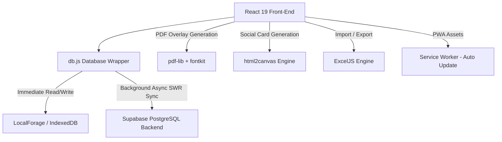

# PropEmpire - Complete Software Engineering Interview Guide

This guide is a comprehensive reference to help you explain, defend, and walk through the **PropEmpire** project in your technical interviews. It covers the system architecture, file-by-file logic, specific design patterns, technical challenges, and real-world optimization decisions you made.

---

## 1. Project Overview & Elevator Pitch

### The Core Problem
Real estate channel partners and field agents spend a significant amount of time on construction sites, show units, and client sites where internet connectivity is highly unreliable. However, they need to log customer details, check property availability, manage follow-up calendars, generate professional invoice PDFs for developer payouts, and send marketing broadcasts on the go.

### The Solution: PropEmpire
PropEmpire is a high-end, responsive **Progressive Web App (PWA)** built using **React 19** and **Vite**. It features:
* **Zero-Latency Offline-First CRM**: An interactive lead and customer logging pipeline.
* **Stale-While-Revalidate Syncing**: Multi-tier caching layer utilizing IndexedDB (via LocalForage) and Supabase (PostgreSQL).
* **Corporate PDF Overlay Engine**: Pixel-perfect, high-fidelity client-side invoice generation (over 300%+ crisper than DOM-to-canvas rendering).
* **Luxury Social Brand Engine**: Dynamic marketing cards created in the browser (HTML5 to Canvas).
* **Personalized WhatsApp Broadcast Loop**: Customized mass messaging without server API costs.
* **Intelligent Excel Engine**: Advanced data mapping and styling of spreadsheet binaries.

---

## 2. System Architecture & Tech Stack



### Technical Stack Details
* **Frontend**: React 19 (Hooks, Context, Functional Architecture)
* **Build tool**: Vite (configured with base path routing, HMR, and PWA manifest generation)
* **CSS System**: High-fidelity Custom Vanilla CSS featuring dynamic variables for dark-mode toggle, responsive grids, animations, and luxury styling.
* **Offline Database**: IndexedDB managed via `localforage` (asynchronous, high capacity, structured storage).
* **Cloud Database**: Supabase (Postgres with Row Level Security).
* **Utility Libraries**:
  * `pdf-lib` (binary PDF parsing/writing)
  * `@pdf-lib/fontkit` (custom font embedding)
  * `exceljs` (reading/writing binary OpenXML spreadsheets)
  * `html2canvas` (DOM tree to canvas rendering)
  * `lucide-react` (high-quality modern iconography)

---

## 3. Database Architecture & Sync Strategy (`src/db.js`)

The app uses a custom implementation of the **Stale-While-Revalidate (SWR)** caching pattern to ensure a zero-latency UI experience while remaining fully functional offline.

### The Code Pattern (Example: `getClients`)
```javascript
export async function getClients() {
  // 1. Immediately return data from local database (IndexedDB)
  const cached = await localforage.getItem('clients_cache');

  // 2. Start a background network request to Supabase asynchronously
  if (supabase) {
    supabase.from('clients')
      .select('*')
      .order('created_at', { ascending: false })
      .then(({ data, error }) => {
        if (!error && data) {
          // Update the local cache silently for the next load
          localforage.setItem('clients_cache', data);
        }
      });
  }

  // 3. UI gets the cache instantly; network lag never blocks the main thread
  if (cached) return cached;
  
  // Fallback: If no cache exists, await the network request
  if (supabase) {
    const { data, error } = await supabase.from('clients').select('*');
    if (data) await localforage.setItem('clients_cache', data);
    return data || [];
  }
  return [];
}
```

### The Schema Bypass Trick (Serialization)
When saving invoices, the Supabase schema had strict table constraints. To avoid breaking database migrations or schemas, you bundled the complex field `billedToName` directly into the `billedToAddress` text column in the background:
* **Saving (`saveInvoice`)**:
  ```javascript
  if (payload.billedToName) {
    payload.billedToAddress = `DEVELOPER_NAME:${payload.billedToName}\n${payload.billedToAddress || ''}`;
  }
  delete payload.billedToName; // Prevents schema crash on database upsert
  ```
* **Retrieving (`processInvoices`)**:
  ```javascript
  const processInvoices = (data) => {
    return (data || []).map(invoice => {
      if (invoice.billedToAddress && invoice.billedToAddress.startsWith('DEVELOPER_NAME:')) {
        const parts = invoice.billedToAddress.split('\n');
        invoice.billedToName = parts[0].replace('DEVELOPER_NAME:', '');
        invoice.billedToAddress = parts.slice(1).join('\n');
      }
      return invoice;
    });
  };
  ```
* **Why do this?** *Interview answer*: "It allowed me to extend the schema dynamically on the client side without needing database migrations, which is a major advantage when rapidly developing a local-first application."

### Supabase Row-Level Security (RLS) (`visited_clients.sql`)
The database schema utilizes Postgres RLS policies to allow authenticated client access via the client's public anonymous key:
```sql
ALTER TABLE public.visited_clients ENABLE ROW LEVEL SECURITY;

CREATE POLICY "Allow anonymous read access to visited_clients"
ON public.visited_clients FOR SELECT TO anon USING (true);

CREATE POLICY "Allow anonymous insert/update/delete access"
ON public.visited_clients FOR ALL TO anon USING (true) WITH CHECK (true);
```

---

## 4. Key Functional Features & Implementations

### A. The Client-Side PDF Overlay Engine (`src/utils/invoiceTemplate.js`)
Instead of using unstable DOM-to-canvas rendering for official corporate documents, you built a binary PDF merger.
1. **The Core Strategy**: You loaded a base template (`Invoice.pdf`) which has the company logo, borders, headers, and gridlines.
2. **Embedding Fonts**: Standard PDFs do not render custom fonts unless embedded. You loaded Poppins `.ttf` binaries from the public directory, registered `fontkit` with `pdf-lib`, and embedded them as binary objects.
3. **Drawing Text**: You mapped out exact pixel coordinates (`POSITIONS`) for every fields:
   ```javascript
   const drawField = (key, options = {}) => {
     const value = fields[key];
     if (!value) return;
     const fontSize = options.fontSize || 14;
     page.drawText(value, {
       x: POSITIONS[key].x,
       y: height - POSITIONS[key].y - fontSize * 0.85, // Adjust Y for PDF coordinate system (origin bottom-left)
       size: fontSize,
       font: options.bold === false ? regularFont : boldFont,
       color: rgb(0, 0, 0),
     });
   };
   ```
* **Benefits**: 
  * Absolute crispness: The PDF is vector-based. Text can be copied and scales infinitely without blurring.
  * Ultra-small file size (~500KB instead of multi-megabyte canvas screenshots).
  * Highly optimized for mobile: No expensive server processing or cold starts.

---

### B. Smart Excel Importer & Custom Styled Exporter (`src/utils/spreadsheet.js`)
Rather than standard, flat CSVs, PropEmpire generates fully formatted, brand-aligned reports.
1. **The Custom Styled Exporter**:
   * Utilizes `exceljs` to generate a dynamic workbook.
   * Merges title cells at the top and injects the corporate branding: Deep Navy (`#0F172A`) for title font, Champagne Gold (`#D4AF37`) for metadata, and soft grid borders.
   * Freezes the top 4 rows (`worksheet.views = [{ state: 'frozen', ySplit: 4 }]`) so headers remain visible when scrolling.
   * Calculates column auto-widths based on maximum content length to prevent cell clipping (`###` errors in Excel).
2. **The Smart Excel Parser**:
   * Reads raw `.xlsx` binary buffers uploaded via `<input type="file" />`.
   * Maps column headers dynamically. Since raw Excel dumps from external ad campaigns use varying header naming schemes (e.g. `Client Name`, `Full Name`, `Customer`), your parser uses keyword mapping:
     ```javascript
     const getVal = (keywords) => {
       for (const key of Object.keys(row)) {
          if (keywords.some(k => key.toLowerCase().includes(k))) 
             return row[key] ? row[key].toString() : '';
       }
       return '';
     };
     const name = getVal(['name', 'client', 'customer']);
     const phone = getVal(['phone', 'mobile', 'contact', 'number']);
     ```
   * Auto-detects where the header row is located:
     ```javascript
     const textValues = rowValues.map(v => (v ? v.toString().toLowerCase().trim() : ''));
     if (textValues.some(v => v.includes('name') || v.includes('phone'))) {
       headerRowIndex = rowNumber;
     }
     ```

---

### C. WhatsApp Broadcast Loop & Personalized Messaging (`src/pages/Clients.jsx`)
Real estate agents often broadcast hot deals, project launches, or custom messages to multiple clients.
* **The Personalization Engine**: Uses regex template replacement on templates:
  ```javascript
  const personalizedMsg = broadcastMsg.replace(/\{name\}/g, client.name || 'there');
  ```
* **Popup Blocker Bypass**: Browsers block rapid loops opening multiple `window.open` tabs. You solved this by adding an asynchronous delay:
  ```javascript
  for (let i = 0; i < targets.length; i++) {
    const phone = formatWaNumber(client.phone);
    const waUrl = `https://wa.me/${phone}?text=${encodeURIComponent(personalizedMsg)}`;
    window.open(waUrl, '_blank');
    
    if (i < targets.length - 1) {
      await new Promise(r => setTimeout(r, 800)); // 800ms throttle preserves browser security clearance
    }
  }
  ```

---

### D. Luxury Brand Generator (`src/pages/PropertyCards.jsx`)
This feature allows agents to instantly create beautiful property flyers to share on WhatsApp or Instagram stories.
1. **Interactive Styling**: Offers multiple curated color palettes (Premium Navy, Luxury Dark, Elegant White, Royal Emerald) styled with gold borders.
2. **Image Handlers & Canvas Taint Prevention**: The user can choose beautiful property backgrounds from unsplash URLs. When rendering the HTML card block to a downloadable PNG via `html2canvas`, standard canvas objects throw a security error if external images are loaded. You resolved this by passing:
   * `crossOrigin="anonymous"` in the HTML `` tag.
   * `useCORS: true` and `allowTaint: true` in the `html2canvas` configurations.
3. **High Definition Scale**: You generated high-resolution assets by setting `scale: 3` in `html2canvas`, ensuring the saved image looks sharp on high-DPI smartphone displays.

---

## 5. Potential Interview Questions & Answers

### Q1: "Why did you use localforage over standard localStorage?"
> *"I chose `localforage` because it acts as an asynchronous wrapper around IndexedDB. Standard `localStorage` is synchronous and blocks the main UI thread during read/write operations, which degrades performance for complex datasets. Additionally, `localStorage` has a strict 5MB limit, whereas IndexedDB provides virtually unlimited storage capacity (up to 50%+ of free disk space). This allows us to cache large files, user profiles, logo images base64 encoded, client arrays, and invoice histories without worrying about storage quota overflows."*

### Q2: "How does the app work if the user is completely offline?"
> *"The database layer `db.js` is fully resilient. If the network is down, the Supabase client checks are skipped or catch gracefully, and the data is read/written to the IndexedDB cache using `localforage`. The UI updates immediately without showing error screens. When the network is restored, subsequent actions query both local storage first, then fetch background updates to keep the local database synchronized."*

### Q3: "What were your performance considerations for PDF rendering on mobile?"
> *"Instead of using server-side PDF generation (which introduces latency and hosting costs) or full HTML-to-canvas rendering (which causes fuzzy text and massive files on mobile screens), I chose `pdf-lib` to overlay values directly onto an existing, optimized PDF template. By loading Poppins TTF fonts only once and drawing text at coordinate positions, the generation is synchronous, takes less than 200ms in the browser, and results in a highly readable vector PDF that is 10x smaller in file size than an equivalent canvas screenshot."*

### Q4: "How does Vite handle the Progressive Web App (PWA) configuration?"
> *"I integrated `vite-plugin-pwa` in `vite.config.js`. It generates a Web App Manifest and registers a Service Worker in production (`main.jsx`). The manifest defines settings like `display: standalone` and corporate theme colors (`#0A2540`). We set the cache update policy to `autoUpdate` to download new app versions in the background, and configured a `navigateFallbackDenylist` to prevent the service worker from intercepting external API routes or the marketing website directory."*

### Q5: "How does the routing work without a router library like React Router?"
> *"To keep the PWA extremely lightweight and secure custom tab switching without routing overhead, I implemented hash routing (`window.location.hash`) combined with page navigation states (`activeTab`). We listen for the `popstate` event to support native mobile back-button clicks, ensuring a fluid mobile app experience: if a user clicks the Android back button, the browser history pops to the previous page state automatically."*

---

## 6. Bullet Points for Your Resume
* **Architected a local-first Progressive Web App (PWA)** using React 19, Vite, and IndexedDB, synchronized with a Supabase PostgreSQL backend, ensuring 100% CRM availability in low-network field conditions.
* **Engineered a client-side vector PDF generator** using `pdf-lib` to dynamically overlay invoice parameters onto compressed templates, reducing page load times and saving server execution costs.
* **Developed an automated Excel parser** using `exceljs` that maps and imports tabular lead data with header auto-detection, speeding up lead imports from social media ad campaigns.
* **Coded a customized canvas-based brand card generator** utilizing `html2canvas` with CORS integration, enabling mobile agents to download sharp (300dpi) branded property graphics on the fly.
* **Implemented an asynchronous WhatsApp broadcast utility** with built-in popup throttle controls, allowing personalized templated message delivery to target clients without external API fees.
